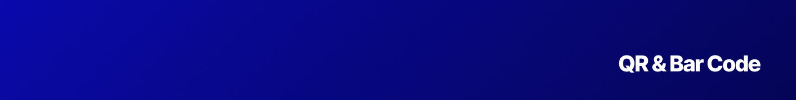

<p align="center"></p>

[![npm version][npm-version-src]][npm-version-href]
[![GitHub Actions][github-actions-src]][github-actions-href]
[](http://commitizen.github.io/cz-cli/)
<!-- [![npm downloads][npm-downloads-src]][npm-downloads-href] -->
<!-- [![Codecov][codecov-src]][codecov-href] -->

# QR & Barcode Library & CLI

> A QR & Barcode Library for Node.js/Bun and the Browser. And CLI.

## Features

- 🤖 QR & Barcode Generating & Decoding
- 📦 **Lightweight**: Zero dependencies
- 🚀 **Fast**: Built with performance in mind
- 📜 **TypeScript**: Strongly typed
- 📚 **Simple**: Easy to use
- 📖 **Documentation**: Well-documented
- 🛠 **Library & CLI**: Interact in different ways

## Install

It's simple to install the library and CLI:

```bash
npm install qar
bun add qar
yarn add qar
pnpm add qar
```

_Check out the package.json scripts for more commands._

## Usage

wip

## Testing

```bash
bun test
```

## Changelog

Please see our [releases](https://github.com/stackjs/qar/releases) page for more information on what has changed recently.

## Contributing

Please see [CONTRIBUTING](.github/CONTRIBUTING.md) for details.

## Community

For help, discussion about best practices, or any other conversation that would benefit from being searchable:

[Discussions on GitHub](https://github.com/stacksjs/qar/discussions)

For casual chit-chat with others using this package:

[Join the Stacks Discord Server](https://discord.gg/stacksjs)

## Postcardware

Stacks OSS will always stay open-sourced, and we will always love to receive postcards from wherever Stacks is used! _And we also publish them on our website. Thank you, Spatie._

Our address: Stacks.js, 12665 Village Ln #2306, Playa Vista, CA 90094, United States 🌎

## Sponsors

We would like to extend our thanks to the following sponsors for funding Stacks development. If you are interested in becoming a sponsor, please reach out to us.

- [JetBrains](https://www.jetbrains.com/)
- [The Solana Foundation](https://solana.com/)

## Credit

- **ts-qrcode**:

## License

The MIT License (MIT). Please see [LICENSE](LICENSE.md) for more information.

Made with 💙

<!-- Badges -->
[npm-version-src]: https://img.shields.io/npm/v/qar?style=flat-square
[npm-version-href]: https://npmjs.com/package/qar
[github-actions-src]: https://img.shields.io/github/actions/workflow/status/stacksjs/qar/ci.yml?style=flat-square&branch=main
[github-actions-href]: https://github.com/stacksjs/qar/actions?query=workflow%3Aci

<!-- [codecov-src]: https://img.shields.io/codecov/c/gh/stacksjs/qar/main?style=flat-square
[codecov-href]: https://codecov.io/gh/stacksjs/qar -->
